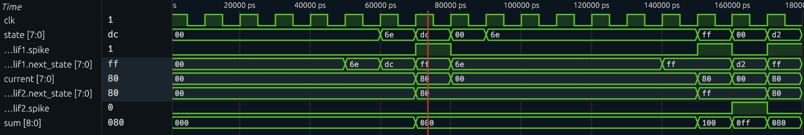

## How it works

Integrate-and-Fire Network: 
This is a two-layer feedforward SNN based on IF. It takes input voltages (ui_in) and treats that as the input current injection to the IF neuron. When neuron 1 reached the threshold, it spikes and sends a fixed synaptic weight of 128 to neuron 2. Neuron 2 adds the two weights and after crossing the threshold, triggers final network spike.

## Design choices
IF network instead of LIF so information isn't lost due to leakage. Saturating addition used so neuron hits threshold and stays there, even if input values are small. Fixed synaptic weight of 128 used to make sure that two spikes from first layer triggers second layer (128+128 > 200).

## How to test

docker run --rm -it -v "$(pwd)":/workspace jeshragh/ece183-293-win bash
cd test
make -B

Apply input to ui_in and check uo_out for accumulation of internal state. 
ex: Set ui_in to a spike-inducing value (like 110) then uio_out[6] goes high.
    neuron 2's state increases by 128 after spike (uo_out == 128). Repeat, then uio_out[7] should fire only after second spike

## External hardware
N/A

